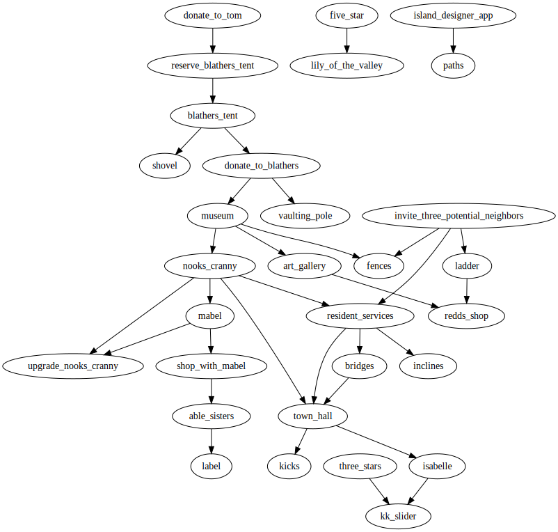
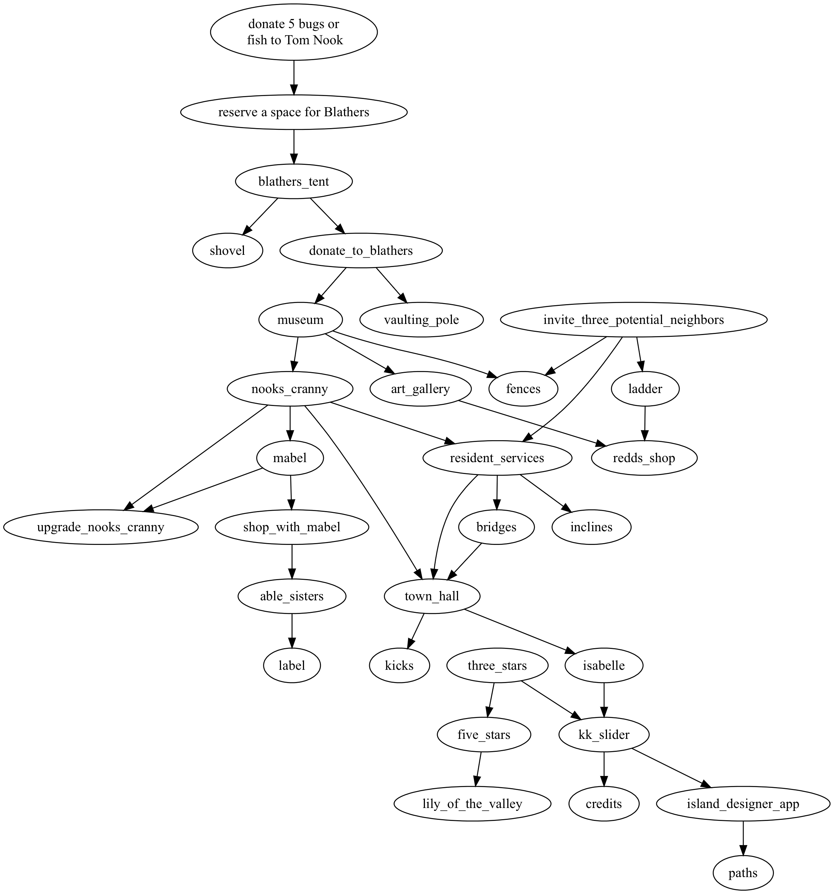

# acnh-tech-tree

## What is it?
It's a tech tree for ACNH, Animal Crossings New Horizons.
I was blocked because I got distracted by turnips, so I read over some resources and made a planning graph.

## Caveats
It's really incomplete, and inaccurate in spots.
It's a WIP, work in progress.
It largely covers the _early_ game: the Polygon guides consider the bulk of this to be in the first two weeks of gameplay.
(I'm going more slowly, so you may not want to follow my work too closely.)

Having said all that: even the earliest version of this got me back on track.

## Show me the graph
Here it is as a possibly-searchable SVG file:

Here it is as a PNG image:

## References
* Polygon's walkthroughs for the [first week](https://www.polygon.com/animal-crossing-new-horizons-switch-acnh-guide/2020/3/20/21182290/first-week-daily-goals-how-to-unlock-museum-steps-farming) and [second week](https://www.polygon.com/animal-crossing-new-horizons-switch-acnh-guide/2020/3/27/21196990/second-week-daily-goals-walkthrough-how-to-unlock-clothing-shop-unlocks-steps)
  * If I'd seen this earlier, I might not have started this project
* [USgamer's guide](https://www.usgamer.net/articles/animal-crossing-new-horizons-beginners-guide-and-walkthrough) was useful, but less straightforward

## Keywords and phrases
* dependencies
* prerequisites
* tech tree
* "what does this require"
* "this is gated on that"
* blocking, unblocking
